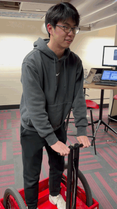

# ECE 551: Digital System Design & Synthesis

🚨 **Looking for my Self-Balancing "Segway" Controller?** 🚨

Here are the direct links to the core project files and verifications:

* 🛴 **[Main Segway RTL Source Code](https://github.com/zeninchen/Segway-Project/tree/main/Project)** 
* 🐍 **[Bit-True Python Golden Model (Steering)](https://github.com/zeninchen/Segway-Project/tree/main/EX22)** *(Contatins steer_en_tb_val_.py, the python golden model)
* 📉 **[Piezo Driver Area Optimization](https://github.com/zeninchen/Segway-Project/tree/main/EX20)** *(Contains `piezo_drv.sv` for the optimized version, and `piezo_drv_old.sv` for the pre-optimization baseline).*

---
*Note: The rest of this repository contains minor weekly assignments for digital logic and SystemVerilog.*
